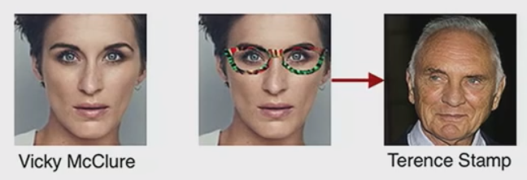

# ML-In-Cybersecurity-Paper
This document is summary of my presentation about Real and Stealthy Attacks on State-of-the-Art Face Recognition Systems at the Seminar: Machine Learning in Cyber-security Sommer Semester 18/19 at FU Berlin. My presentation was based on [Accessorize to a Crime: Real and Stealthy Attacks on State-of-the-Art Face Recognition](https://www.cs.cmu.edu/~sbhagava/papers/face-rec-ccs16.pdf) paper. Sharif et al  came up with idea of generating an eyeglass frames, which when worn by an attacker allow him/her to avoid being recognized as himself/herselfor to impersonate another person from biometric system database. Presentation I gave during the seminar discussed details of generating such eyeglass frames. 

## Example Attack on FRS using eyeglass frames

## Paper
Compiled pdf version of paper is [Seminar_ML_in_It_Security.pdf](Seminar_ML_in_It_Security.pdf)

## Main tex file
Main LaTeX File: [00.tex](00.tex

## Template
Used LaTeX template: [template_ausarbeitung.tex](template_ausarbeitung.tex)

## Authors
* [tugot17](https://github.com/tugot17)

## License
This project is licensed under the MIT License - see the [LICENSE](LICENSE) file for details
